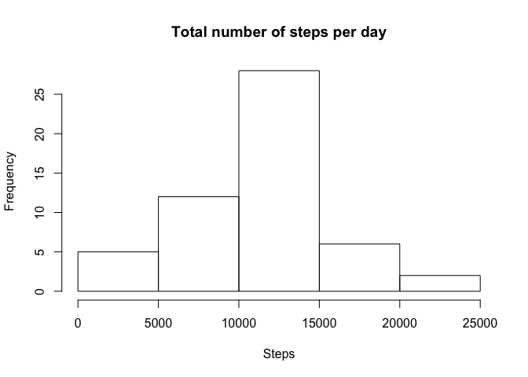
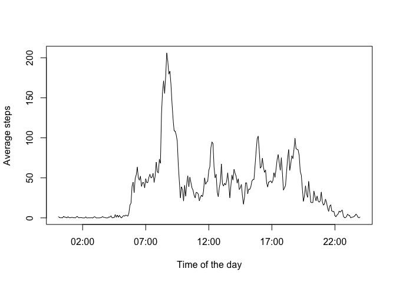
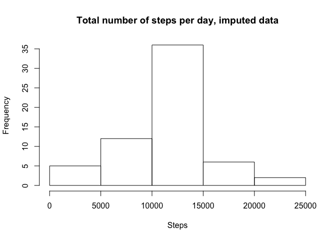
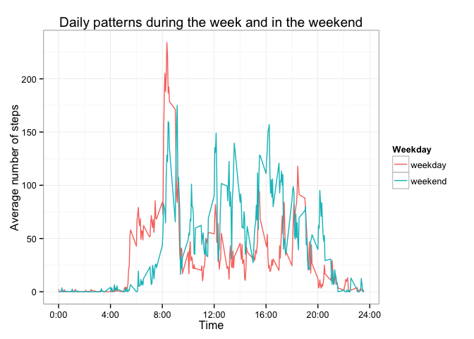

# Reproducible Research: Peer Assessment 1

This is an analysis of data collected at 5 minute intervals from an (anonimous) personal activity monitoring device over two months (Oct-Nov 2012). The data were provided within the Johns Hopkins course on Data Science - Reproducible Researh (May 2015 version; https://github.com/rdpeng/RepData_PeerAssessment1) and unzipped in the working directory. [activity.csv]

## Loading and preprocessing the data

```r
activity <- read.csv("activity.csv", header = TRUE, 
                     colClasses = c("numeric", "Date", "numeric"))
summary(activity)
```

```
##      steps             date               interval     
##  Min.   :  0.00   Min.   :2012-10-01   Min.   :   0.0  
##  1st Qu.:  0.00   1st Qu.:2012-10-16   1st Qu.: 588.8  
##  Median :  0.00   Median :2012-10-31   Median :1177.5  
##  Mean   : 37.38   Mean   :2012-10-31   Mean   :1177.5  
##  3rd Qu.: 12.00   3rd Qu.:2012-11-15   3rd Qu.:1766.2  
##  Max.   :806.00   Max.   :2012-11-30   Max.   :2355.0  
##  NA's   :2304
```

## What is mean total number of steps taken per day?

To get the daily totals of steps we can use the `dplyr` package:


```r
library(dplyr)
```

```
## Warning: package 'dplyr' was built under R version 3.1.2
```

```
## 
## Attaching package: 'dplyr'
## 
## The following object is masked from 'package:stats':
## 
##     filter
## 
## The following objects are masked from 'package:base':
## 
##     intersect, setdiff, setequal, union
```

```r
dailyact <- data.frame(summarise(group_by(activity, date), Sum = sum(steps)))
summary(dailyact)
```

```
##       date                 Sum       
##  Min.   :2012-10-01   Min.   :   41  
##  1st Qu.:2012-10-16   1st Qu.: 8841  
##  Median :2012-10-31   Median :10765  
##  Mean   :2012-10-31   Mean   :10766  
##  3rd Qu.:2012-11-15   3rd Qu.:13294  
##  Max.   :2012-11-30   Max.   :21194  
##                       NA's   :8
```

Here is a histogram of the total number of daily steps

```r
hist(dailyact$Sum, main = "Total number of steps per day", xlab = "Steps")
```

 

The median and mean total number of daily steps (taken from the summary above) are 10765 and 10766, respectively.

## What is the average daily activity pattern?

To look at the average daily pattern, we can take the interval averages over two months:

```r
intervalact <- data.frame(summarise(group_by(activity, interval), 
                                    Average = mean(steps, na.rm = TRUE)))
head(intervalact)
```

```
##   interval   Average
## 1        0 1.7169811
## 2        5 0.3396226
## 3       10 0.1320755
## 4       15 0.1509434
## 5       20 0.0754717
## 6       25 2.0943396
```

Now we may plot the average number of steps per interval, using a time series on the x-axis:


```r
intervalact$Time <- ISOdatetime(2015,5,10,0,0,0, tz = "") + seq(0:287) * 5 * 60

plot(intervalact$Time, intervalact$Average, xlab = "Time of the day", ylab = "Average steps", type = "l")
```

 

The interval in which, on average, the highest number of steps is taken:

```r
intervalact[intervalact[,2] == max(intervalact[,2]),1:2]
```

```
##     interval  Average
## 104      835 206.1698
```
From 8:35 to 8:40 in the morning.

## Imputing missing values

The data include a number of missing values: 2304

```r
sum(is.na(activity))
```

```
## [1] 2304
```

We can use a loop to replace each `NA` with the interval average: for each row, if `steps` equals `NA`, the value is replaced with the corresponding interval average, taken from `intervalact`. These are imputed in the duplicate dataset activity1:

```r
#Duplicate activity to activity1
    activity1 <- activity
    
for(i in 1:nrow(activity)) {
    intav <- intervalact[intervalact[,1] == activity[i,3],2]    
    if(is.na(activity[i,1])) {
        activity1[i,1] <- intav
    }
}
```

Now, the mean total number of steps per day:


```r
dailyact1 <- data.frame(summarise(group_by(activity1, date), Sum = sum(steps)))
summary(dailyact1)
```

```
##       date                 Sum       
##  Min.   :2012-10-01   Min.   :   41  
##  1st Qu.:2012-10-16   1st Qu.: 9819  
##  Median :2012-10-31   Median :10766  
##  Mean   :2012-10-31   Mean   :10766  
##  3rd Qu.:2012-11-15   3rd Qu.:12811  
##  Max.   :2012-11-30   Max.   :21194
```

The median and mean total number of daily steps are (both) 10766. (Taken from the summary above.)

Thus, there is very little impact of (imputing) the missing values on the average of daily step totals. Here is a histogram of the imputed data.

```r
hist(dailyact1$Sum, main = "Total number of steps per day, imputed data", 
     xlab = "Steps")
```

 


## Are there differences in activity patterns between weekdays and weekends?

First, we add a column to indicate weekday vs weekend:

```r
#Duplicate the dataset
activity2 <- activity

#Add the new factor
activity2$Weekday <- rep("weekday", 288)

#Change the factor to weekend where appropriate
for(i in 1:nrow(activity2)) {    
    if(weekdays(activity2[i,2]) == "Saturday" | weekdays(activity2[i,2]) == "Sunday") {
        activity2[i,4] <- "weekend" 
    }
}
```

To compare the average number of steps across either a weekday or a weekend day, we adapt the earlier calculation:

```r
intervalact1 <- data.frame(summarise(group_by(activity2, interval, Weekday), 
                                    Average = mean(steps, na.rm = TRUE)))
head(intervalact1)
```

```
##   interval Weekday   Average
## 1        0 weekday 2.3333333
## 2        0 weekend 0.0000000
## 3        5 weekday 0.4615385
## 4        5 weekend 0.0000000
## 5       10 weekday 0.1794872
## 6       10 weekend 0.0000000
```

Now we may plot the average number of steps per interval


```r
library(ggplot2)
```

```
## Warning: package 'ggplot2' was built under R version 3.1.2
```

```r
plot <- ggplot(intervalact1, aes(interval, Average))
plot + geom_line(aes(color = Weekday)) + scale_x_continuous(breaks=c(0,400, 800, 1200, 1600, 2000, 2400), labels=c("0:00", "4:00", "8:00", "12:00", "16:00", "20:00", "24:00")) + theme_bw() + labs(title = "Daily patterns during the week and in the weekend", x = "Time", y = "Average number of steps")
```

 

In conclusion, there are differences between workdays and weekends. As expected, workdays tend to start being active (measured in numbers of steps) a bit earlier than weekends, but are less 'active' during working hours than the same time in the weekend. 
